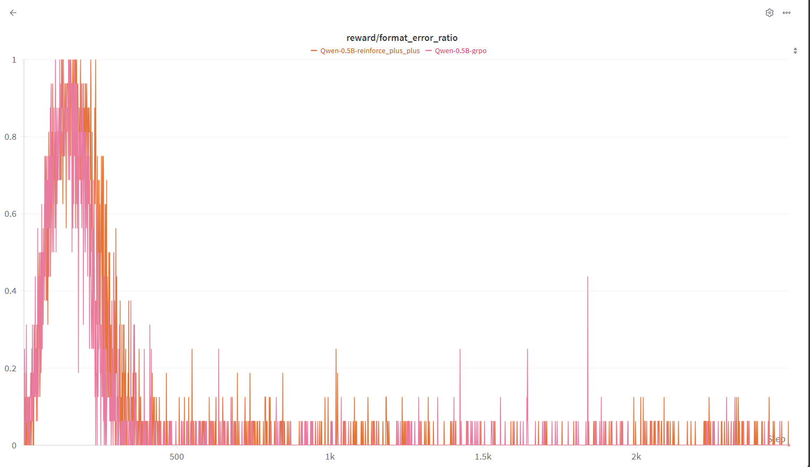
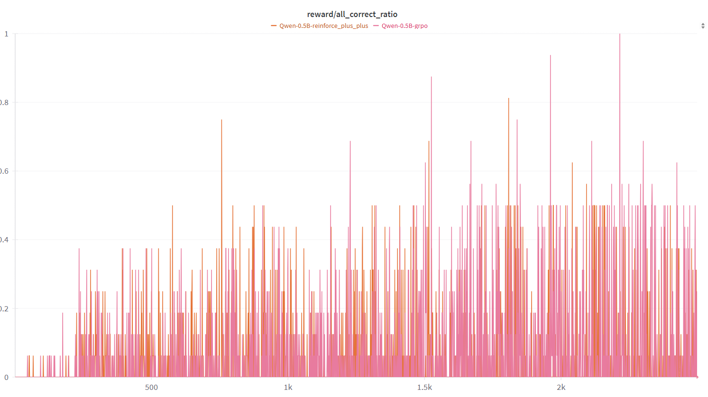

# Week 15 (May. 26- Jun. 1) Report 
+ We conducted complete training of the model using GRPO and REINFORCE++, and stored the corresponding models for subsequent analysis. 
+ Building on last week's results, we found that the algorithm's accuracy in formatting continues to improve as training progresses.

+ In addition, we observed that REINFORCE++ did not show a significant improvement over GRPO, as claimed in the paper.
+ As stated in the paper, we also did not observe the "aha moment" during the training process.

+ Under the framework of LogicRL, we implemented ReMAX and LOO, and will train them separately in the following steps.
+ From the training process, it appears that the forced use of `<think> ... </think>` does not truly make the model engage in reasoning. This could be a potential area for further exploration.